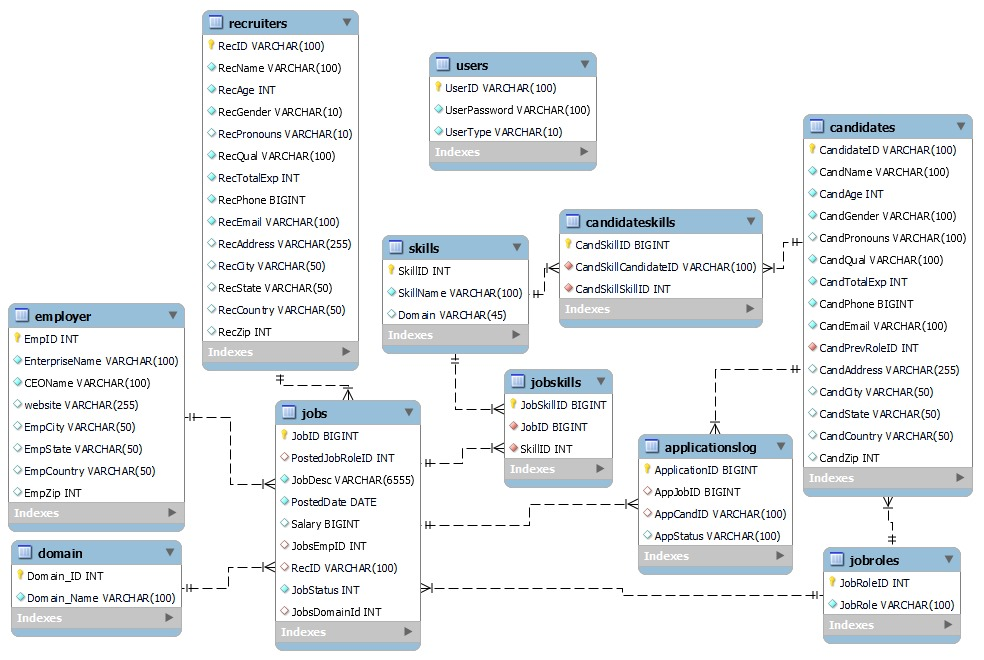

# Job Search Platform Documentation

## Introduction
- A comprehensive platform for job seekers, employers, and recruiters.
- Designed to streamline the job search and hiring process.

## Schema Overview
- A relational database schema that efficiently organizes and manages job search data.
- Ensures data integrity and facilitates complex queries.



### Architecture
The database is organized into tables representing different entities:

- `Users`: Manages user login credentials and types.
- `Candidates`: Stores detailed information about job seekers.
- `Recruiters`: Holds data on recruiters using the platform.
- `Employer`: Contains details about companies and organizations.
- `Jobs`: Lists available job positions along with descriptions and related information.
- `JobSkills` and `CandidateSkills`: Manage the skills associated with jobs and candidates respectively.
- `ApplicationsLog`: Tracks the status of job applications.
- `JobRoles` and `Domain`: Auxiliary tables that categorize jobs and skills into various roles and domains.

### Structure
The structure is defined with primary keys, foreign keys, and constraints to ensure data consistency:

- Use of `AUTO_INCREMENT` in primary keys for unique identification.
- `VARCHAR`, `INT`, and `DATE` data types for accommodating textual, numerical, and temporal data.
- `CHECK` constraints for validating data such as age and gender.
- Foreign key relationships to maintain referential integrity between tables.

## Key Features
- **User Management:** Distinct tables for candidates, recruiters, and employers.
- **Job Listings:** Detailed job descriptions with roles, salaries, and status.
- **Skills Matching:** Associates skills with jobs and candidates for precise matching.
- **Application Tracking:** Logs every application's progress and final status.

## Real-World Application
- **Career Progression:** Enables candidates to find opportunities that match their career aspirations.
- **Talent Acquisition:** Assists employers in discovering candidates with the desired skill set.
- **Recruitment Process:** Streamlines the recruitment workflow for efficiency.

## Tech Stack and Libraries
- **Database:** MySQL for data storage and management.
- **Backend:** Node.js for server-side logic.
  - **Express.js:** Web application framework for Node.js to handle HTTP requests.
- **Frontend:** React.js for a responsive user interface.
  - **React Router:** Declarative routing for React applications.
  - **Axios:** Promise-based HTTP client for making API calls.
- **Package Manager:** npm or Yarn for managing dependencies.
  - **npm:** Node package manager for installing and managing node libraries.
  - **Yarn:** Fast, reliable, and secure dependency management.
- **Version Control:** Git for source code management.
  - **GitHub:** Hosting for software development and version control using Git.

Make sure you have the latest versions installed to ensure compatibility and security.


```markdown
## Quick Start

To set up and launch the job search platform on your local machine, follow these steps:

1. **Clone the Repository:**
   ```sh
   git clone <repository-url>
   ```

2. **Install Dependencies:**
   Navigate to the project directory and install the required dependencies:
   ```sh
   cd <project-directory>
   npm install
   # or if using Yarn
   yarn install
   ```

3. **Database Setup:**
   Initialize your MySQL database and import the provided schema. Make sure MySQL is running and then execute:
   ```sh
   mysql -u <username> -p <database_name> < path/to/schema.sql
   ```

4. **Environment Variables:**
   Configure your environment variables for database access by creating a `.env` file in the root directory and populating it with your details:
   ```plaintext
   DB_HOST=localhost
   DB_USER=<your_username>
   DB_PASS=<your_password>
   DB_NAME=<your_database_name>
   ```

5. **Run the Backend Server:**
   Start the backend server using Node.js:
   ```sh
   node server.js
   # or use nodemon for development to automatically restart the server on changes
   npx nodemon server.js
   ```

6. **Launch the Frontend Application:**
   In a new terminal window, start the React frontend:
   ```sh
   npm start
   # or with Yarn
   yarn start
   ```

After both the server and client have been started, you can navigate to `http://localhost:3000` in your web browser to view the application.

Remember to replace `<repository-url>`, `<project-directory>`, `<username>`, `<database_name>`, `<your_username>`, `<your_password>`, and `<your_database_name>` with your actual repository URL, project directory name, MySQL username, MySQL database name, and your MySQL credentials, respectively.
```

Just replace the angle-bracketed placeholders (e.g., `<repository-url>`, `<your_username>`) with the actual values for your project setup.

## Quick Start
1. **Setup:** Clone the repository and install dependencies.
2. **Database:** Initialize the MySQL database with the provided schema.
3. **Server:** Start the backend server using Node.js.
4. **Client:** Launch the React.js frontend application.

## Contribution
- Contributions are welcome! Feel free to submit pull requests or open issues.

Thank you for exploring our job search platform project!

Certainly! Here is a single block of text formatted for Markdown that you can copy and paste directly into your README file:

